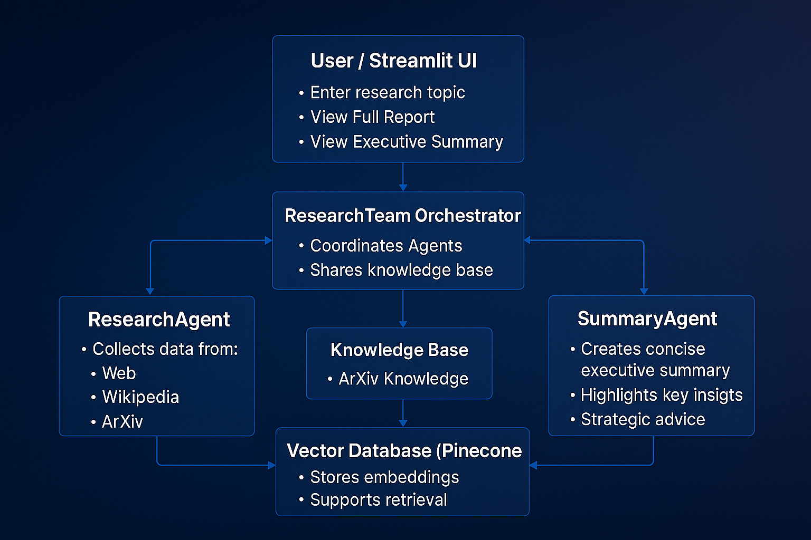

# 💡 IdeaForge AI: AI Agents Collaborative Research
A multi-agent AI system that autonomously performs comprehensive research on any topic. It orchestrates specialized agents to collect references, analyze findings, and generate executive summaries, enabling fast, structured, and high-quality research reports.

---

## 🌟 Features

* **Multi-Agent Collaboration**: ResearchAgent, AnalysisAgent, and SummaryAgent work together to produce research reports.
* **Diverse Source Integration**: Collects information from web, Wikipedia, and ArXiv.
* **Structured Reporting**: Produces detailed reports with sections like Key Findings, Strategic Implications, and Future Outlook.
* **Executive Summary Generation**: Distills reports into actionable, concise summaries for decision-makers.
* **Interactive Dashboard**: Streamlit interface to input topics, view results, and download reports.

---

## 🛠️ Tech Stack

* **Programming Language**: Python 3.10+
* **AI Models**: Groq (Gemma2-9B-IT)
* **Vector Database**: Pinecone
* **Embedding Service**: Cohere
* **AI Framework**: Agno
* **Web Interface**: Streamlit
* **Other Tools**: DuckDuckGo, Wikipedia, ArXiv APIs

---

## 📂 Project Structure

```
Multi-Agent-Research-Assistant/
├─ app/
│  ├─ agents/
│  │  ├─ research_agent.py       # Agent to collect references
│  │  ├─ analysis_agent.py       # Agent to generate detailed report
│  │  └─ summary_agent.py        # Agent to create executive summary
│  └─ config.py                  # API keys and configuration
│  ├─ knowledge.py               # Knowledge base setup (ArXiv + Wikipedia)
│  ├─ research_team.py           # Team orchestration for multi-agent workflow
├─ app.py                        # Streamlit app entry point
└─ requirements.txt              # Python dependencies
```

---

## 🚀 Usage

### 1. Clone the repository

```bash
git clone https://github.com/SravanVenigalla/Multi-Agent-Research-Assistant.git
cd Multi-Agent-Research-Assistant
```
### 2. Create and activate a virtual environment

```bash
# Create virtual env
python3 -m venv venv  

# Activate (Linux/Mac)
source venv/bin/activate  

# Activate (Windows PowerShell)
venv\Scripts\activate
```

### 3. Install dependencies

```bash
pip install -r requirements.txt
```

### 4. Configure API Keys

Create a `.env` file in the root directory:

```
GROQ_API_KEY=your_groq_api_key
COHERE_API_KEY=your_cohere_api_key
PINECONE_API_KEY=your_pinecone_api_key
PINECONE_INDEX_NAME=your_index_name
```

### 5. Run the Streamlit app

```bash
streamlit run app.py
```

## 🏗️ Architecture

<p align="center">
  
</p>

---

## 🤝 Contribution

Contributions are welcome! Feel free to fork the repo and submit a pull request.

---

## 📜 License

MIT License. Free to use and modify.
